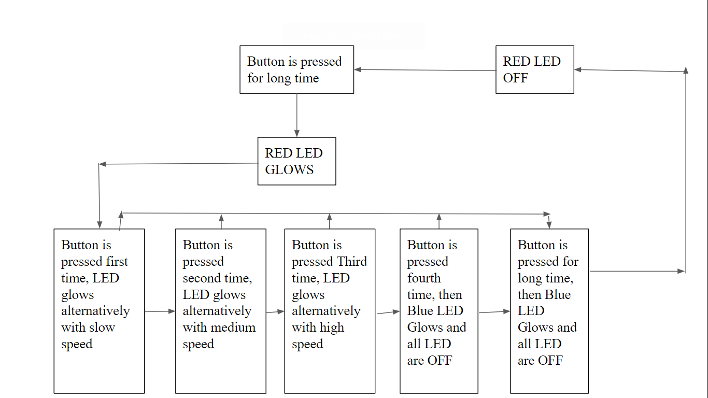

# ARCHITECTURE
* MCU used is STM32F4 Discovery board 1.
* For ease of simulation different LED represent the positions of Wiper Arm.
* For Input Push button on STM32F4 Discovery board 1 is used.
* STM32F4 Discovery board 1 Timer is used to control speed of differernt LED Glowing alternatively. 
# FLOWDIAGRAM

