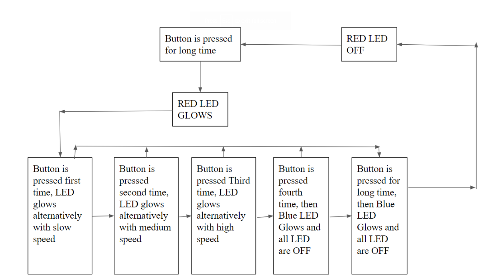
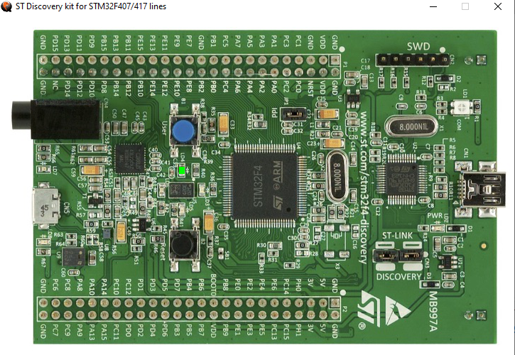

# ABSTRACT
#### In the fast moving world Car is very important mode of transport system. But in times of Rain it is difficult to look through Car making drive very difficult. So wiper system which helps to clear the Rain water on windshield allowing Driver to look through windshield during rain is important in Car. Wiper system consists of wiper drive and wiper arm. Wiper drive moves the wiper arm. But old wiper system has a disadvantage. That is when we activate wiper system to clear Rain water and deactivate it the wiper arm will not come to rest at 0 degree angle rather it will come to rest at the position where we deactivate it. So to avoid it from blocking driver to see through windshiel driver should deactivate when it is at 0 degree angle. This is difficult in many situations. So to avoid this advantage we need to add a mechanism to bring wiper arm to 0 degree angle every time we deactivate it. This is what we aim in this project.

## FEATURES
* Wiper is powered on when button long pressed once.
* Wiper starts moving slowly when button pressed once.
* Wiper starts moving with medium speed when button pressed twice.
* Wiper starts moving with high speed when button pressed thrice.
* Wiper stops moving when button pressed for fourth time.
* The pattern continues from next press.
* Wiper is powered off when button long pressed again.
## 5W's 1H
|WHY|WHEN|WHAT|WHERE|WHO|HOW|
|:--:|:--:|:--:|:--:|:--:|:--:|
|To make wiper system more efficient and avoid disadvantage of old wiper system.|At times of Rain.|Mechanism to enhance wiper system.|Car.|Whoever drives car.|With MCU and push buttons.
## SWOT
|STRENGTH|WEAKNESS|OPPERTUNITY|THREATS|
|:--:|:--:|:--:|:--:|
|Avoid disadvantage od old wiper system.|It doesnt work automatically.|Can be automated with sensor data.|Might malfunction due to rain water and take more time to respond

## High Level Requirements
| ID | High Level Requirements |
| -------- | -------------- |
| HLR1 | It Powers ON Wiper control system|
| HLR2 | It Powers OFF Wiper control system |
| HLR3 | It moves wiper arm at different speed|
| HLR4 | It Brings wiper arm to 0 degree angle when wiper is powered OFF|

## Low Level Requirements
| ID | Low Level Requirements for HLR1|
|:--:|:--:|
| LLR 1.1 | If button is pressed and held it Power ON Red LED|

| ID | Low Level Requirements for HLR2|
|:--:|:--:|
| LLR 2.1 | If button is pressed and held it when Wiper is already powered Power OFF Red LED|

| ID | Low Level Requirements for HLR3|
|:--:|:--:|
| LLR 3.1 | Glows Blue, Green and Orange LED alternatively with slow speed in clockwise manner when  pressed Once|
| LLR 3.2 | Glows Blue, Green and Orange LED alternatively with medium speed in clockwise manner when  pressed twice|
| LLR 3.2 | Glows Blue, Green and Orange LED alternatively with high speed in clockwise manner when  pressed thrice|
| LLR 3.2 | LED glow pattern stops on the 4th press and the wiper action starts on next press from slow speed|

| ID | Low Level Requirements for HLR4|
|:--:|:--:|
| LLR 4.1 | When it is powered OFF Blue LED must Glow Finally |

# ARCHITECTURE
* MCU used is STM32F4 Discovery board 1.
* For ease of simulation different LED represent the positions of Wiper Arm.
* For Input Push button on STM32F4 Discovery board 1 is used.
* STM32F4 Discovery board 1 Timer is used to control speed of differernt LED Glowing alternatively. 
# FLOWDIAGRAM

# HIGH LEVEL TEST PLAN
|TEST ID|DESCRIPTION|INPUT|EXPECTED OUTPUT|ACTUAL OUTPUT|
|:--:|:--:|:--:|:--:|:--:|
|1|Power ON|Long press button|Power ON Wiper system|Power ON Wiper system|
|2|Power OFF|Long press button|Power OFF Wiper system|Wiper keeps moving|
|3|Slow speed|Press button once|Move wiper arm with slow speed|Move wiper arm with slow speed|
|4|Medium speed|Press button twice|Move wiper arm with medium speed|Move wiper arm with medium speed|
|5|High speed|Press button thrice|Move wiper arm with high speed|Move wiper arm with high speed|
# LOW LEVEL TEST PLAN
|TEST ID|DESCRIPTION|INPUT|EXPECTED OUTPUT|ACTUAL OUTPUT|
|:--:|:--:|:--:|:--:|:--:|
|1|Power ON Wiper system|Long press button|Power ON RED LEDPower ON RED LED|Power ON RED LEDPower ON RED LED|
|2|Power OFF Wiper system|Long press button|Power OFF RED LED|LED toggles|
|3|Move wiper arm with slow speed|Press button once|Glow LEDs alternatively with slow speed|Glow LEDs alternatively with slow speed|
|4|Move wiper arm with medium speed|Press button twice|Glow LEDs alternatively with medium speed|Glow LEDs alternatively with medium speed|
|5|Move wiper arm with high speed|Press button thrice|Glow LEDs alternatively with high speed|Glow LEDs alternatively with high speed|

# OUTPUT

